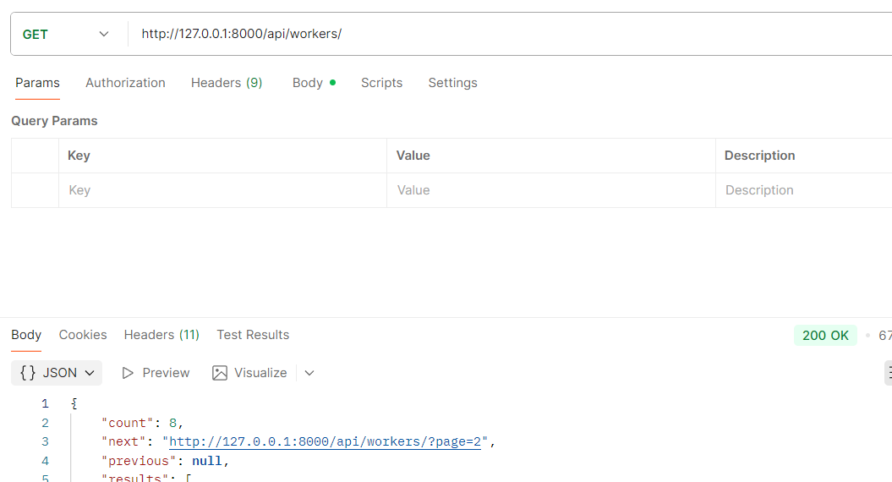
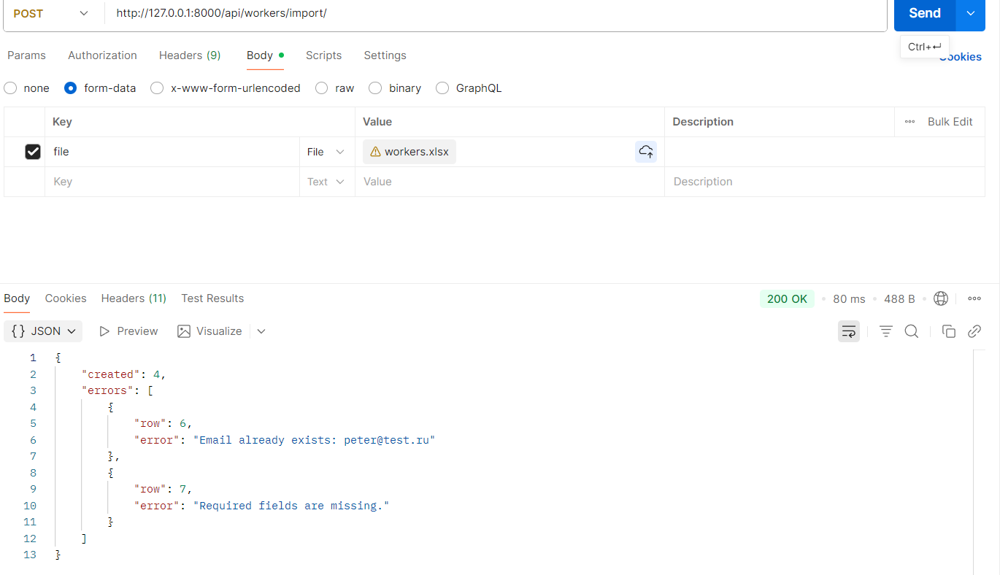
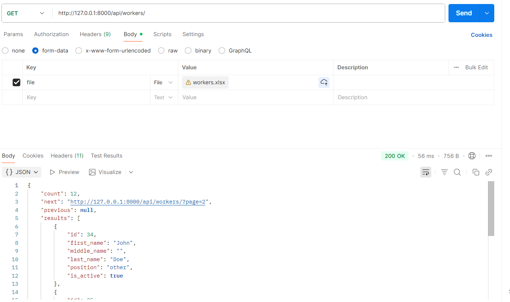

# task-for-kiosc

Task for KIOSC

This project was generated with [`wemake-django-template`](https://github.com/wemake-services/wemake-django-template). Current template version is: [bd95589](https://github.com/wemake-services/wemake-django-template/tree/bd955898e344eeefcb758dbff4e4e720abc92039). See what is [updated](https://github.com/wemake-services/wemake-django-template/compare/bd955898e344eeefcb758dbff4e4e720abc92039...master) since then.


[](https://wemake-services.github.io)
[](https://github.com/wemake-services/wemake-python-styleguide)


### Содержание:

1. [Как развернуть проект](#как-развернуть-проект-🚀)
2. [Как создать пользователей с разными ролями](#как-создать-пользователей-с-разными-ролями-👥)
3. [Как запустить тесты](#как-запустить-тесты-и-линтеры-🧪)
4. [Как протестировать импорт данных](#как-протестировать-импорт-данных-📥)
<br><hr>

## Как развернуть проект 🚀

1. Клонируйте репозиторий

```bash
git clone git@github.com:dzyundzya/task-for-kiosc.git

cd task-for-kiosc
```
2. Установите зависимости
```bash
poetry install
```
3. Активируйте виртуальное окружение Poetry
```bash
source .venv/Scripts/activate
```
4. Настройте окружение
```bash
cp .env.example .env
```
Отредактируйте `.env`, указав свои настройки.
5. Примените миграции
```bash
poetry run python manage.py migrate
```
6. Создайте суперпользователя
```bash
poetry run python manage.py createsuperuser
```
7. Запустите сервер
```bash
poetry run python manage.py runserver
```
Приложение будет доступно по адресу:
👉 http://127.0.0.1:8000/

**Endpoints:**
- `GET /api/workers/` — список работников
- `POST /api/workers/` — создание работника
- `GET /api/workers/{id}/` — детальная информация
- `PATCH /api/workers/{id}/` — обновление
- `DELETE /api/workers/{id}/` — удаление
- `POST /api/workers/import/` — импорт работников из Excel

## Как создать пользователей с разными ролями 👥

```
Аутентификация реализована с помощью - Djoser + JWT

Все добавленные пользователи автомотический получаеют роль - User

Через административную панель можно выбрать роль - admin, зайдя в аккаунт за superuser
```
| Метод   | URL                      | Описание                                              |
| ------- | ------------------------ | ----------------------------------------------------- |
| `POST`  | `/api/auth/jwt/create/`  | 🔐 Получить `access` и `refresh` токен                |
| `POST`  | `/api/auth/jwt/refresh/` | 🔁 Обновить `access` токен                            |
| `POST`  | `/api/auth/jwt/verify/`  | ✅ Проверить токен                                     |
| `POST`  | `/api/auth/users/`       | 👤 Регистрация нового пользователя                    |
| `GET`   | `/api/auth/users/me/`    | 🔍 Получить профиль текущего пользователя (по токену) |
| `PATCH` | `/api/auth/users/me/`    | ✏️ Обновить профиль                                   |


## Как запустить тесты и линтеры 🧪

Покрытие тестам - 100%, `wemake-django-template` - супер строгий на тесты и линетры

---
Для запуска всех тестов проекта:
```bash
poetry run pytest
```
Для запуска линтеров:
```bash
poetry run mypy .
poetry run ruff check 
poetry run ruff format
poetry run flake8 .
```

## Как протестировать импорт данных 📥

1. `workers.xlsx` - находится в корне проекта

2. Отправь запрос через Postman

__Метод__: `POST` <br>
__URL__: `http://127.0.0.1:8000/api/workers/import/`

__Body → form-data:__
| Key  | Type | Value        |
| ---- | ---- | ------------ |
| file | File | workers.xlsx |

___
Пример:







## Проект сделал:
### [✍️ Dzyundzya Alexandr](https://github.com/dzyundzya)
### 📧 dzyundzya.aa@yandex.ru 
### Telegram: @dzyundzya